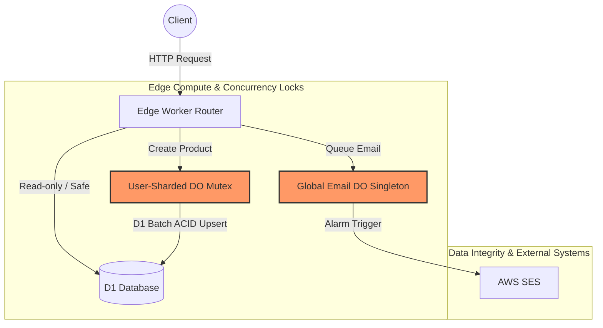

---
# Cloudflare Edge Backend
---

::: info 🔗 Project Quick Links
- **[View Source Code on GitHub](https://github.com/heriwijoyo/cloudflare_api_service)**
:::

# ⚡Architecting at the Edge: Enterprise Serverless Backend

> **An enterprise-grade, edge-native micro-SaaS backend demonstrating zero-latency data integrity, deterministic system behavior, and strict downstream concurrency protection using Cloudflare Workers, Durable Objects, and D1.**

## 📖 Executive Summary
In modern edge-computing topologies, scaling to 100,000 concurrent requests is easy; maintaining **strict state serializability, ACID compliance, and downstream rate-limit protection** is hard. 

This repository serves as a portfolio of architectural patterns designed to solve distributed systems challenges at the edge. By leveraging Cloudflare's serverless stack, this project implements user-sharded Mutex locks, deterministic observability templates, and global concurrency choke-points to protect vulnerable third-party APIs.

---

## 🏗️ System Architecture

The architecture routes stateless edge traffic through stateful Durable Objects when strict concurrency is required, before committing atomic batches to the D1 global database.




---

## 🧠 The Hard Problems Solved

### 1. Distributed Limit Checking (The User-Sharded DO Mutex)

**The Problem:** Standard stateless edge workers are highly susceptible to "Phantom Reads" and race conditions when multiple concurrent requests attempt to check and accumulate a user's subscription limits.
**The Solution:**

* Requests are routed through a User-Sharded Durable Object (`PRODUCT_SERVICE_DO.getByName(userId)`), funneling global concurrent requests into a strict, localized queue.
* To prevent the V8 isolate event loop from yielding to other requests during D1 database reads, I utilized Cloudflare's native `ctx.blockConcurrencyWhile()`. This pushes concurrency buffering to the edge infrastructure itself, guaranteeing perfect state serialization without bloating the isolate's memory with user-land Promise queues.
* Both the Business Entity (`Product`) and the Telemetry/Limits (`Accumulation`) are written via a single D1 `db.batch()` to ensure ACID atomicity.

### 2. Protecting Downstream Limits (The Global Concurrency Lock)

**The Problem:** Serverless edge functions can instantly scale to thousands of concurrent requests. If those workers hit external APIs directly (like AWS SES, which limits production throughput to ~14 emails/sec), the AWS account would be immediately suspended for rate-limit violations.
**The Solution:**

* Instead of building for maximum theoretical throughput, I intentionally engineered a **Global Concurrency Lock** using a Singleton Durable Object.
* Emails are persisted to D1 with a `PENDING` state. A Durable Object Alarm wakes up asynchronously and processes batches of exactly 14 emails concurrently, guaranteeing AWS SES limit compliance regardless of how much traffic the edge workers receive.

### 3. Zero-Effort Edge Observability (The Template Pattern)

**The Problem:** In serverless environments, there is no central server to attach a global logging middleware to. As teams scale, developers often forget to wrap database queries and external network hops in telemetry trackers.
**The Solution:**

* I implemented strict **Template Patterns** (`executeServiceProcess`, `executeBatchQuery`, `callExternalService`).
* No business logic or D1 execution occurs outside these templates. This guarantees that *every single* API request, D1 query, and external network hop automatically emits its duration, success state, and trace ID, creating an enterprise-grade telemetry pipeline with zero extra developer effort.

---

## ⚖️ Architectural Trade-offs

A core responsibility of an architect is acknowledging that every decision is a compromise. Here are the documented trade-offs for this system:

* **Cloudflare D1 vs. Remote Postgres/MySQL:**
* *Why D1:* Traditional managed databases charge for "uptime" and require connection pooling (TCP). In a micro-SaaS model with bursty traffic, maintaining thousands of open TCP connections from edge workers is an anti-pattern. D1's HTTP-based execution eliminates connection limits and drives infrastructure costs down to near zero during idle times.
* *The Trade-off:* D1 relies on SQLite, which is heavily optimized for reads but restricted to a single concurrent writer. I mitigated this by batching transactions and routing high-contention writes through Durable Object concurrency locks.


* **Native Lock (`blockConcurrencyWhile`) vs. User-Land Promise Queue:**
* *Why Native Lock:* When managing the DO Mutex, I opted to halt all incoming DO traffic natively rather than managing an in-memory Promise Queue.
* *The Trade-off:* While a Promise Queue allows for surgical, granular read/write locking, it risks crashing the DO's 128MB memory limit during massive traffic spikes. The native lock sacrifices granular read-responsiveness in exchange for absolute memory safety at scale.


---

## 🚀 Getting Started & Deployment

This project uses **Wrangler** to manage edge deployments, local simulations, and D1 database migrations.

### Prerequisites

* Node.js (v18+ recommended)
* An active [Cloudflare](https://dash.cloudflare.com/) account (for production deployment)

### 1. Local Development (Simulated Edge)

Cloudflare's `wrangler` provides a complete local emulation of the edge environment, including local D1 instances and Durable Object state.

```bash
# Install dependencies
npm install

# Apply database migrations to your local SQLite/D1 instance
npx wrangler d1 migrations apply demo --local

# Start the local development server
npm run dev

```

### 2. Production Deployment

To deploy this architecture to Cloudflare's global network, you need to provision the D1 database and publish the worker.

```bash
# 1. Authenticate with your Cloudflare account
npx wrangler login

# 2. Create the production D1 database
npx wrangler d1 create demo

# 3. IMPORTANT: Copy the `database_id` output from the previous command 
#    and paste it into your `wrangler.jsonc` file.

# 4. Apply migrations to the production D1 database
npx wrangler d1 migrations apply demo --remote

# 5. Deploy the Worker and Durable Objects to the edge
npm run deploy

```

### 🧪 API Testing

Once running locally or remotely, you can test the endpoints.
*(Note: Replace `http://localhost:8787` with your production worker URL if deployed).*

**Simulate Product Creation (Triggers D1 Batching & DO Mutex):**

```bash
curl -X POST http://localhost:8787/createOrder \\
-H "Content-Type: application/json" \\
-d '{
  "userId": "demoUser12345",
  "products": [
    { "productId": "prod-1", "quantity": 1 },
    { "productId": "prod-2", "quantity": 3 }
  ]
}'

```